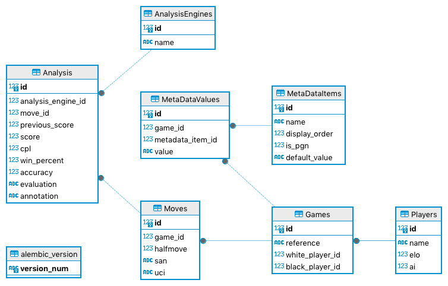

Database Configuration
======================

.. note::
    The analyser includes an "alembic.sh" script at the top of the project folder structure. This sets up
    the Virtual Environment and creates a new "chess.db" database in the "data" sub-folder or apply
    the latest updates to the copy of the database in that folder. This simplifies managing the database
    so it's recommended, though not mandatory, to use it. This document assumes it is being used.

Database Schema
---------------

The Chess Analyser uses a SQLite back-end with the following schema:

+-----------------+-----------------------------------------------------------------------------------------------+
| **Table**       | **Comments**                                                                                  |
+-----------------+-----------------------------------------------------------------------------------------------+
| Players         | Player details - name, ELO, AI indicator                                                      |
+-----------------+-----------------------------------------------------------------------------------------------+
| Games           | Game records, containing references to the two player records by ID                           |
+-----------------+-----------------------------------------------------------------------------------------------+
| MetaDataValues  | Set of metadata values, referencing the associated metadata item and game by ID               |
+-----------------+-----------------------------------------------------------------------------------------------+
| MetaDataItems   | Available metadata items                                                                      |
+-----------------+-----------------------------------------------------------------------------------------------+
| Moves           | Moves, one per record, referencing the parent game by ID                                      |
+-----------------+-----------------------------------------------------------------------------------------------+
| Analysis        | Per-move analyses, referencing the associated move and the engine creating the analysis by ID |
+-----------------+-----------------------------------------------------------------------------------------------+
| AnalysisEngines | Analysis engines referenced by the Analysis records                                           |
+-----------------+-----------------------------------------------------------------------------------------------+

Locating the Database
---------------------

When the application is run, it uses the following rules, in the order shown, to locate the database file:

+-----------------------------------------------+--------------------------------------------------------------------------+
| **Condition**                                 | **Location of the Database File**                                        |
+-----------------------------------------------+--------------------------------------------------------------------------+
| Development Environment                       | Use the database file "chess.db" in the "data" sub-folder of the project |
+-----------------------------------------------+--------------------------------------------------------------------------+
| CHESS_ANALYSIS_DB environment variable is set | Use the database file pointed to by CHESS_ANALYSIS_DB                    |
+-----------------------------------------------+--------------------------------------------------------------------------+
| CHESS_ANALYSIS_DB is not set                  | Use the database file "chess.db" in the "data" sub-folder of the project |
+-----------------------------------------------+--------------------------------------------------------------------------+

The application is considered to be running in a development environment if the path to the working copy
of the project includes a path element "Development". For example, both of the following would be considered
to be development environments:

.. code-block::

    /home/user/projects/development/ChessAnalysis
    /Users/user/Development/Projects/ChessAnalysis

.. warning::
    It is **STRONGLY** recommended that, for the live data, the CHESS_ANALYSIS_DB environment variable is set to point to
    a database location outside the working copy of the project. This provides complete separation between the live data
    and the development environment.

Creating a New Database
-----------------------

Assuming the project's "data" sub-folder doesn't exist or doesn't contain the "chess.db" database file,
a new, empty, database can be created by running the following from the top-level folder of the project:

.. code-block:: bash

    ./alembic.sh

Alembic should run and create the database in the "data" sub-folder, creating that folder first if it
doesn't exist.

Assuming all is well and no errors are produced, the file "data/chess.db" can be copied to the intended live
database location and renamed accordingly.

Updating an Existing Database
-----------------------------

.. warning::
    Before applying updates to a database containing live data, it's essential that a backup copy of the
    database file is made to avoid loss of data in the unlikely event that the update process fails.

Asuming the live copy of the database is not "data/chess.db", relative to the top level project folder,
first copy it to "data/chess.db".

Then run the following from the top-level folder of the project:

.. code-block:: bash

    ./alembic.sh

Alembic should run and report any updates applied to the database file.

Assuming all is well and no errors are produced, the file "data/chess.db" can be copied back to the live
database location and renamed accordingly.
