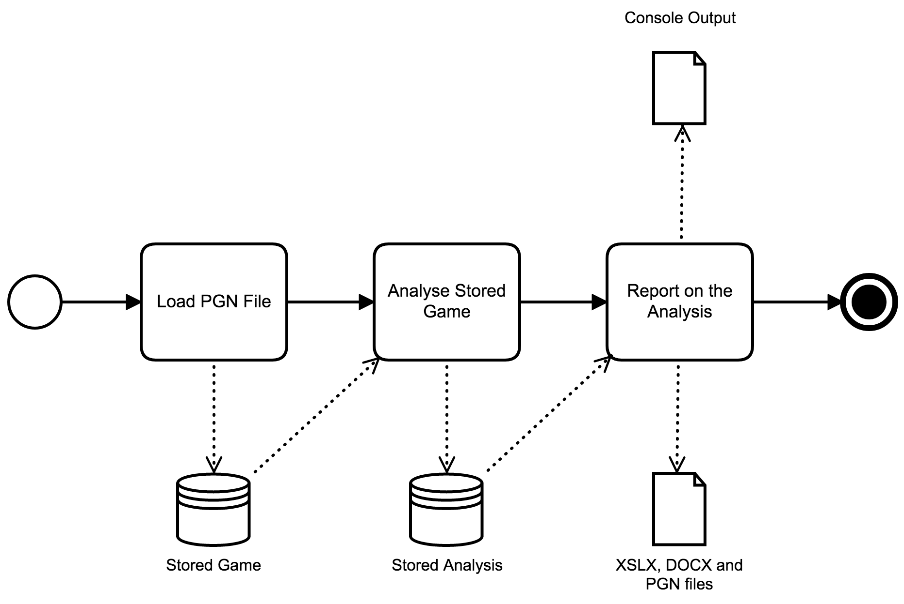

Analysis Workflow
=================

.. note::
    The analyser includes a "run" script at the top of the project folder structure. This sets up
    the Virtual Environment and passes command line arguments supplied to the script through to the
    analyser. This simplifies running the application so it's recommended, though not mandatory, to
    use it. This document assumes it is being used.

Analysing a game has a simple three-step workflow:

Loading a Game
--------------

To load a PGN file into the database:

.. code-block:: bash

    run.sh --load --pgn "<path-to-pgn-file>" --reference "<unique-game-reference>"

The PGN file path and reference must be enclosed in double-quotes, as shown, if they contain spaces
but quoting is optional if they don't.

On load, games are stored with a reference that's used to refer to them in the analysis and reporting
phases and must therefore be unique - the application will show an error and will not import the PGN
file if the reference is already in use.

Analysing a Game
----------------

To analyse a game that's been loaded:

.. code-block:: bash

    run.sh --analyse --reference "<unique-game-reference>" --engine <engine-name> --verbose

The <engine-name> is the key for the engine as configured in the "engines.json" file (refer to the
engine installation documentation for details). Using the "--verbose" option causes the analysis for
each move to be written to the console. If this is omitted, the analysis is done silently.

Multiple analyses of the same game, using different engines, can be stored in the database concurrently
so, once loaded, a game can be analysed using as many engines as required.

If an analysis is requested and an analysis of the specified game using the specified engine already
exists, the previous analysis is first removed from the database, to be replaced with the new one.

Console-Based Reporting
-----------------------

To report on the analysis for game that's been loaded and analysed, use the following options:

.. code-block:: bash

    run.sh --results --reference "<unique-game-reference>" --engine <engine-name>
    run.sh --white --reference "<unique-game-reference>" --engine <engine-name>
    run.sh --black --reference "<unique-game-reference>" --engine <engine-name>
    run.sh --summary --reference "<unique-game-reference>" --engine <engine-name>
    run.sh --winchance --reference "<unique-game-reference>" --engine <engine-name>
    run.sh --info --reference "<unique-game-reference>"

Where:

- "--results" tabulates the detailed per-move analysis
- "--white" tabulates the detailed per-move analysis for white
- "--black" tabulates the detailed per-move analysis for black
- "--summary" provides a summary consisting of ACPL, accuracy and move annotations (dubious, mistake, blunder) for both players
- "--winchance" tabulates the data used to generate a "Win%" chart [#1]_
- "--info" tabulates the game headers, read from the PGN file

Exporting Analysis Results
--------------------------

To export the analysis for a game that's been loaded and analysed, use the following options:

.. code-block:: bash

    run.sh --export --reference "<unique-game-reference>" --engine <engine-name> --xlsx <spreadsheet>
    run.sh --export --reference "<unique-game-reference>" --engine <engine-name> --docx <document>
    run.sh --export --reference "<unique-game-reference>" --engine <engine-name> --pgn <PGN>

The first form exports a report in XLSX format to the specified spreadsheet, the second exports a report in
DOCX format to the specified document file and the final form writes a PGN file for the game annotated with
the evaluation and annotations for each move.

If required, multiple outputs can be specified in a single export command:

.. code-block:: bash

    run.sh --export --reference "<unique-game-reference>" --engine <engine-name> --xlsx <spreadsheet> --docx <document> --pgn <PGN>

This command exports the analysis in both XLSX and DOCX format and writes the annotated PGN file.

.. [#1] `Lichess win% calculation <https://lichess.org/page/accuracy>`_